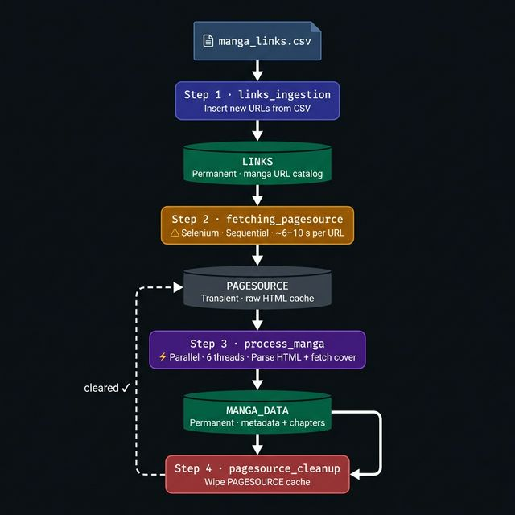

# MangaTrackerX

A manga data ingestion pipeline that scrapes manga metadata and chapter history from Madara-theme sites and stores it in MongoDB Atlas.

- Selenium runs **once per URL** per pipeline run (HTML is cached in MongoDB between steps)
- Step 3 parses all pages **in parallel** (configurable thread count)
- Each step is **idempotent** — safe to re-run at any time

---

## Requirements

| Tool | Minimum version |
|------|----------------|
| Python | 3.13 |
| Google Chrome | Any recent stable |
| MongoDB Atlas account | Free tier works |

---

## Project Structure

```
MangaTrackerX/
├── csv_files/
│   └── manga_links.csv        ← Add your manga URLs here
├── src/
│   ├── pipeline/
│   │   ├── links_ingestion.py       (Step 1)
│   │   ├── fetching_pagesource.py   (Step 2)
│   │   ├── process_manga.py         (Step 3)
│   │   └── pagesource_cleanup.py    (Step 4)
│   └── utilities/
│       ├── database_connection.py
│       ├── extractors.py
│       ├── logger_setup.py
│       └── page_source.py
├── assets/images/placeholder.jpg
├── .env.example
├── requirements.txt
└── README.md
```

---

## Setup

### 1. Clone the repository

```bash
git clone <your-repo-url>
cd MangaTrackerX
```

### 2. Create and activate a virtual environment

```bash
# Create
python -m venv .venv

# Activate (Windows PowerShell)
.venv\Scripts\Activate.ps1

# Activate (macOS / Linux)
source .venv/bin/activate
```

### 3. Install dependencies

```bash
pip install -r requirements.txt
```

> ChromeDriver is managed automatically by Selenium — no manual download needed.

### 4. Configure environment variables

Copy `.env.example` to `.env` and fill in your MongoDB Atlas credentials:

```bash
cp .env.example .env   # macOS / Linux
copy .env.example .env  # Windows
```

```env
# MongoDB Atlas — get these from the Atlas "Connect" dialog
MONGODB_USERNAME=your_atlas_username
MONGODB_PASSWORD=your_atlas_password
MONGODB_DATABASE=your_database_name
MONGODB_CLUSTER=cluster0.xxxxx.mongodb.net

# Optional — shows up in Atlas activity logs
MONGODB_APP_NAME=MangaTrackerX

# Collection names (leave as-is unless you need different names)
LINKS=LINKS
PAGESOURCE=PAGESOURCE
MANGA_DATA=MANGA_DATA
```

**Where to find your cluster address:**  
Atlas dashboard → your cluster → **Connect** → **Drivers** → copy the host portion of the URI  
(e.g. `cluster0.abc12.mongodb.net`)

### 5. Add manga URLs to the CSV

Open `csv_files/manga_links.csv` and add URLs under the `links` column.  
The pipeline supports any site built on the **Madara WordPress theme** (most popular manga aggregators).

```csv
links
https://harimanga.me/manga/some-manga-title
https://harimanga.me/manga/another-manga-title
```

---

## Running the Pipeline

All commands must be run from the **project root** (`MangaTrackerX/`) with the virtual environment active.

```powershell
# Step 1 — Read manga_links.csv and insert new URLs into LINKS
python -m src.pipeline.links_ingestion

# Step 2 — Fetch rendered HTML via Selenium and cache in PAGESOURCE
#           (Sequential — ~6–10 s per URL including polite delay)
python -m src.pipeline.fetching_pagesource

# Step 3 — Parse cached HTML in parallel and upsert into MANGA_DATA
python -m src.pipeline.process_manga

# Step 4 — Wipe the PAGESOURCE cache (ready for the next run)
python -m src.pipeline.pagesource_cleanup
```

Run all four steps in sequence for a full update. Steps 1–4 are safe to re-run — they skip work that's already done.

---

## Architecture

### Collections

| Collection | Lifespan | Purpose |
|---|---|---|
| `LINKS` | Permanent | Manga URL catalog |
| `PAGESOURCE` | Transient — wiped after each run | Selenium HTML cache |
| `MANGA_DATA` | Permanent | Manga metadata + full chapter history |

### Data flow



### MANGA_DATA document shape

```json
{
  "manga_url":      "https://...",
  "manga_title":    "Some Manga Title",
  "manga_site":     "harimanga.me",
  "manga_image":    "https://...cover.jpg",
  "en_manga_image": "<base64-encoded cover>",
  "manga_rating":   "8.5",
  "manga_genre":    "Action, Fantasy",
  "manga_type":     "Manhwa",
  "manga_release":  "2022",
  "manga_status":   "OnGoing",
  "date_added":     "2026-02-26T00:00:00",
  "latest_chapters": [
    { "chapter_num": 173, "chapter_url": "https://...", "chapter_added": "..." },
    ...
  ]
}
```

---

## Configuration

| Constant | File | Default | Description |
|---|---|---|---|
| `REQUEST_DELAY` | `fetching_pagesource.py` | `3` s | Polite delay between Selenium fetches |
| `MAX_WORKERS` | `process_manga.py` | `6` | Parallel threads for Step 3 |
| `CHAPTER_CAP` | `process_manga.py` | `2000` | Max chapters stored per manga |

---

## Troubleshooting

| Symptom | Likely cause | Fix |
|---|---|---|
| `No module named 'src'` | Running from wrong directory | Run from `MangaTrackerX/` root, not a parent folder |
| `Missing MongoDB credentials` | `.env` not created or incomplete | Copy `.env.example` → `.env` and fill all values |
| `Metadata extraction failed` | URL returns 404 or unsupported site layout | Remove the URL from `manga_links.csv` |
| `Timeout` warning in Step 2 | Page loaded slowly / JS-heavy site | Increase `timeout` in `page_source.py` (default: 15 s) |
| Import errors in IDE | Wrong Python interpreter selected | Select `.venv` interpreter in VS Code (`Ctrl+Shift+P` → `Python: Select Interpreter`) |
